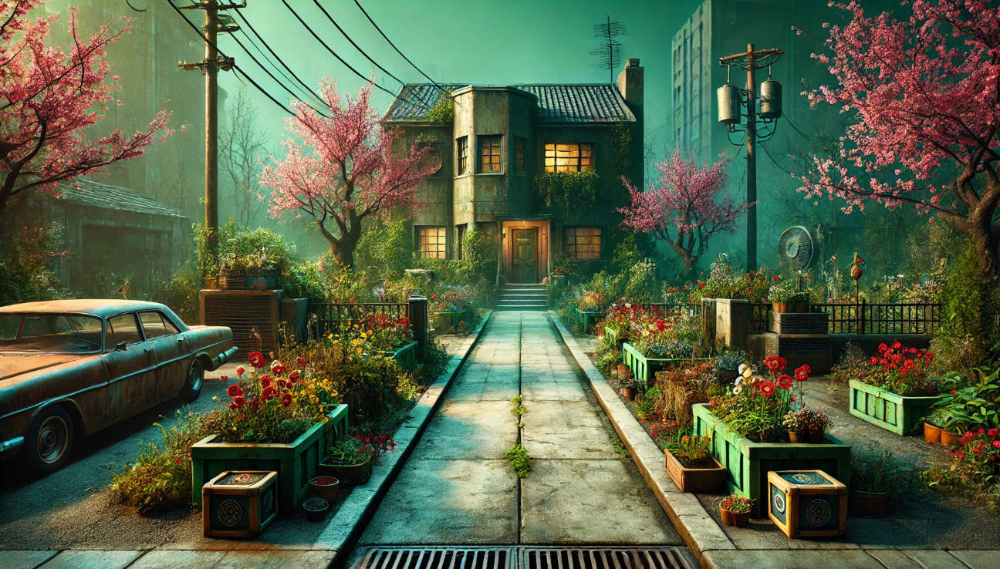
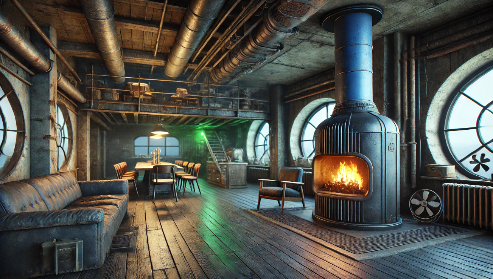
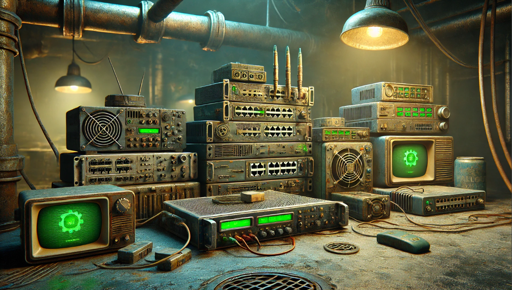
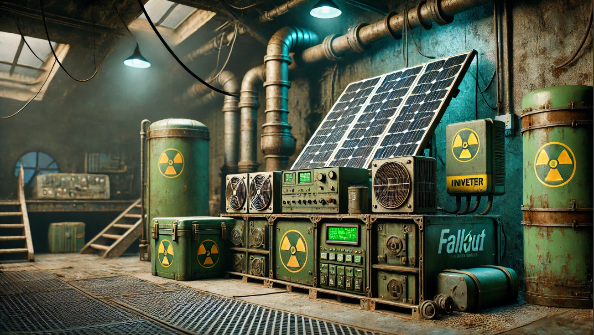
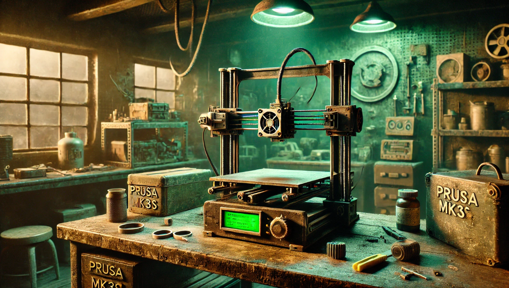
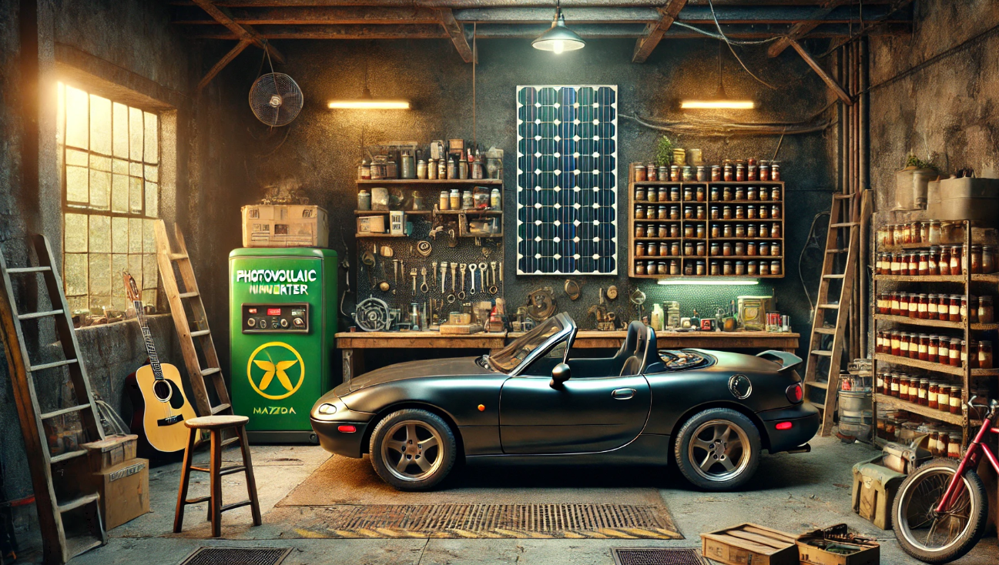
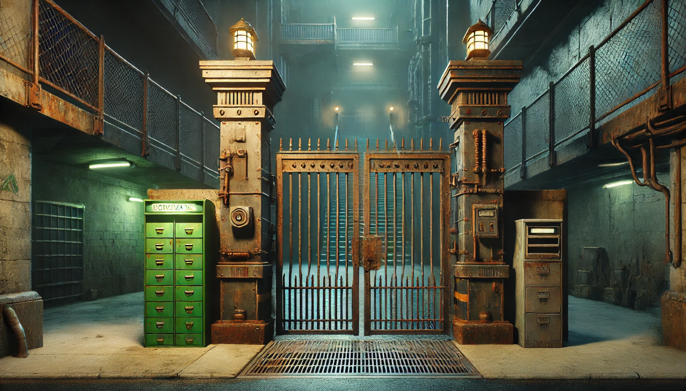
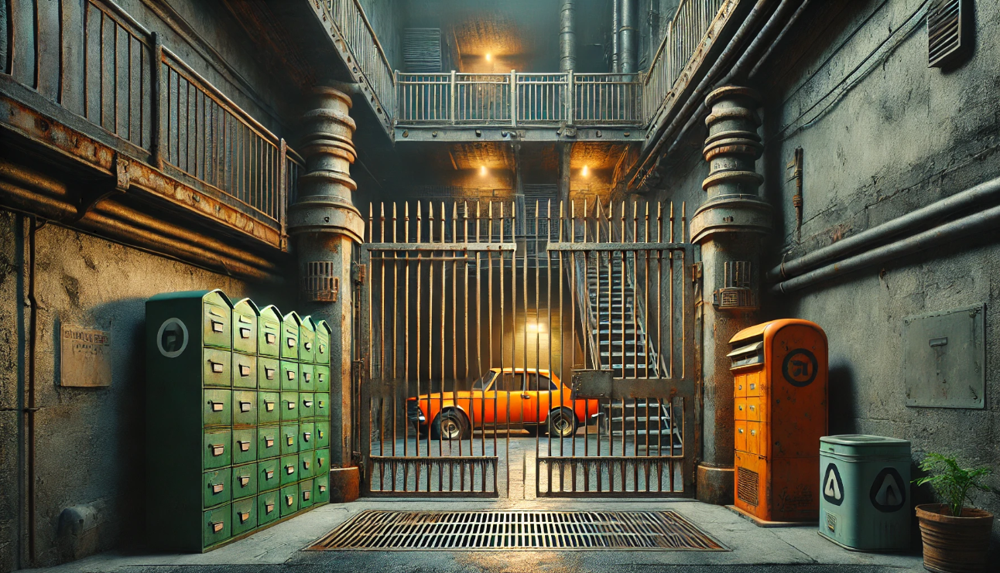
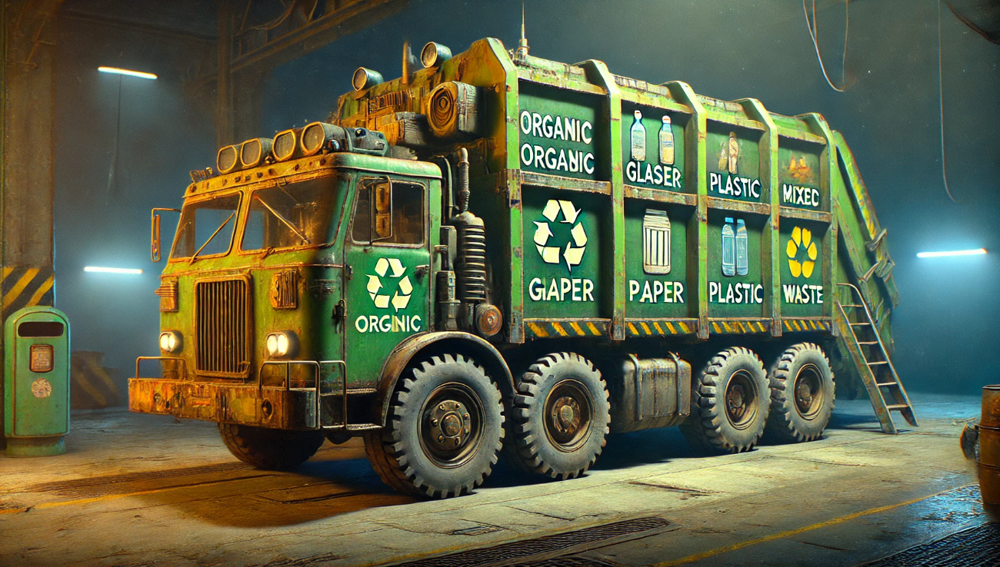

# Dashboard Assets Manifest

## Overview
Repository containing graphic assets for Home Assistant floorplans, room renders, and infrastructure icons.

## Directory Structure & Previews

### 1. Levels & Overview
| Asset Name | Preview | Description |
| :--- | :--- | :--- |
| `level01.png` |  | Ground floor plan |
| `level02.png` |  | First floor plan |
| `attic.png` |  | Attic/Storage area |
| `home-01.png` |  | Property overview |
| `home-garden.png` |  | Garden layout |
| `home-japan.png` |  | Japanese garden section |
| `townhouse.png` |  | External building view |

### 2. Living Spaces
| Asset Name | Preview | Description |
| :--- | :--- | :--- |
| `living-room-2.png` |  | Main Living Room |
| `tv-lounge.png` |  | TV Lounge area |
| `tv-room.png` |  | Dedicated TV Room |
| `kitchen-1.png` |  | Kitchen view 1 |
| `kitchen-2.png` |  | Kitchen view 2 |
| `master-bedroom.png` |  | Master Bedroom |
| `bedroom.png` |  | Standard Bedroom |
| `guest-room.png` |  | Guest Room |
| `office-01.png` |  | Office / Study 1 |
| `office-02.png` |  | Office / Study 2 |
| `bathroom-ground.png` |  | Ground Floor Bathroom |
| `bathroom-upper.png` |  | Upper Bathroom |
| `bathroom-upstairs.png` |  | Upstairs Bathroom |
| `wardrobe.png` |  | Walk-in Wardrobe |

### 3. Circulation & Entry
| Asset Name | Preview | Description |
| :--- | :--- | :--- |
| `entrance.png` |  | Main Entrance |
| `entryway.png` |  | Entryway |
| `vestibule.png` |  | Windbreaker |
| `stairs.png` |  | Main Stairs |
| `under-stairs.png` |  | Storage under stairs |
| `garage-hallway.png` |  | Hallway to garage |

### 4. Technical Infrastructure
| Asset Name | Preview | Description |
| :--- | :--- | :--- |
| `servers.png` |  | Server Room overview |
| `server-cabinet.png` |  | Rack/Cabinet detail |
| `boiler-room.png` |  | Heating system |
| `recuperator.png` |  | Ventilation unit |
| `hvac-01.png` |  | HVAC system |
| `pv.png` |  | Photovoltaics |
| `system.png` |  | System overview |
| `system02.png` |  | System detail |
| `3dprinter-prusa.png` |  | 3D Printer |

### 5. Garage & Exterior
| Asset Name | Preview | Description |
| :--- | :--- | :--- |
| `garage-home.png` |  | Home Garage |
| `garage-01.png` |  | Garage 1 |
| `garage-zs.png` |  | Garage Szczecin |
| `garden-shed-01.png` |  | Garden Shed |
| `terrace.png` |  | Terrace |
| `gate-01.png` |  | Main Gate |
| `gate-02.png` |  | Side Gate |
| `grill.png` |  | BBQ Area |
| `grill-02.png` |  | BBQ Detail |
| `kia.png` |  | Car |
| `waste.png` |  | Waste Management |
| `laundry.png` |  | Utility Room |

## Asset Generation

### Fallout Style Prompt Template
To generate consistent room renders matching the project aesthetic, use the following parameterised prompt. Replace `{ROOM_NAME}` with the specific area (e.g., "Server Room", "Master Bedroom").

> A cinematic wide shot of a {ROOM_NAME} designed in a Fallout Vault style. Aesthetic: Retro-futuristic 1950s Atom-punk, post-apocalyptic shelter, gritty and industrial. Environment: Rusted metal bulkhead walls, exposed ventilation pipes, concrete floor with metal grating, heavy vault-tec architectural elements. Lighting: Dim atmospheric lighting with a dominant phosphor-green radioactive glow, flickering fluorescent tube lights, volumetric fog. Furniture & Props: Worn mid-century modern furniture, bulky analog computer terminals with vacuum tubes and green screens, analog pressure gauges, loose wires, scattered Nuka-Cola bottles. Texture quality: Unreal Engine 5 render, 8k resolution, hyper-realistic, detailed textures of rust and peeling paint, ray-tracing. --ar 16:9 --v 6.0

